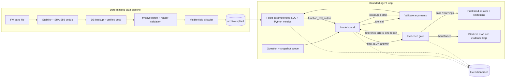
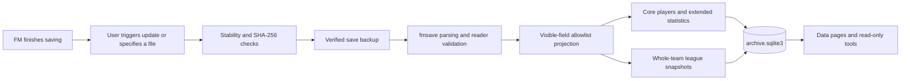
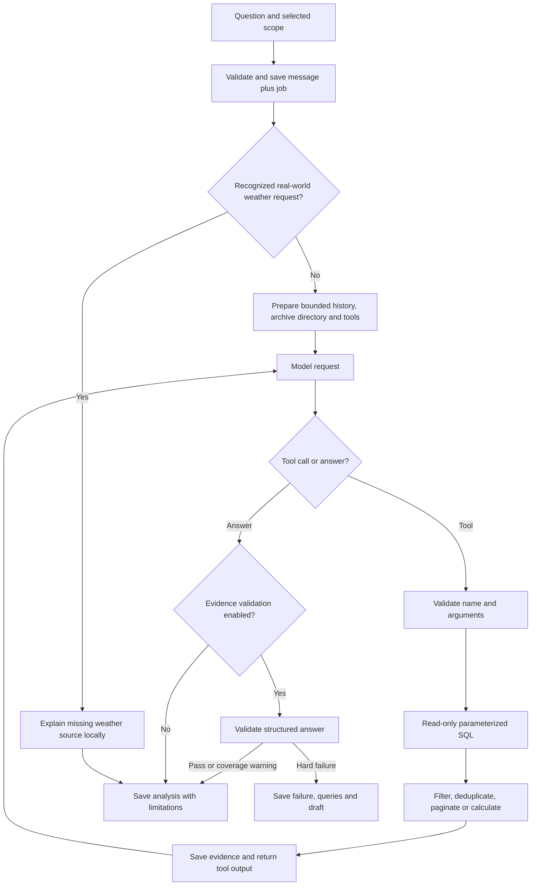

# Leicester Dynasty Archive

A local **Football Manager archive and AI analysis workspace**. Import game saves into SQLite, browse historical snapshots, inspect SQL, and ask an assistant to retrieve evidence, compare players and explain findings.

Two separate conversation spaces share the archive: **Analysis** for football data and **Dressing room** for stories and headcanon. Fiction is not automatically promoted to game fact, and collecting a story is an explicit user action.

This is a bounded **agentic analytics workflow**: the model selects tools and arguments, receives their results, and decides whether to investigate further or answer. Importing, SQL execution, metric calculations, validation and persistence are deterministic application code. The agent cannot freely modify the database or operate the computer.

> Implementation guide, updated October 3, 2026. Available data depends on imported saves. Evidence checks do not guarantee that every natural-language conclusion is correct.

## Scope

This is a personal project that runs locally on Windows. The repository contains application code, English documentation, bilingual UI catalogs and synthetic unit tests. Personal FM saves, SQLite databases, transcripts, screenshots, manual stories, credentials and the private development Git history are excluded.

The application is tailored to a Leicester/Premier League archive. Other clubs and export formats may require code changes.

## Architecture



The pipeline and the agent are separate: imports never call a model, and the agent can only read. Both stages are detailed in the sections below.

## Workspace

The workspace is a single local page containing the chat, the evidence explorer and the archive pages. **Archive and data** (bottom left) opens the squad, statistics, league snapshots, transfers, stories, originals, SQL workbench and checks. **Workspace settings** selects the account, model, snapshot, season, competition, squad and character background.

English is the default repository and interface language. The workspace remembers the browser's language preference across chat and archive pages. The optional legacy Streamlit pages have their own language selector. Changing language does not rewrite stored chats, player or club names, original documents, SQL, or evidence payloads. An explicit request for another answer language can override the default.

The new frontend uses HTML/CSS/JavaScript with a Python HTTP service. All eight archive pages render natively in the workspace, without new tabs or embedded Streamlit pages. They reuse the existing databases and validation functions. Questions remain chronological and collapsed by default, with the composer at the bottom.

Services bind to loopback only; this is not a public deployment. Closing a browser does not stop the service. Pinned dependencies are recorded in `uv.lock`.

## Features

- Leicester squad, visible attributes, season statistics, retained match records, injuries and transfer evidence.
- Historical snapshots and continuously tracked Premier League team rosters and season statistics.
- Whole-squad attacking comparisons: totals, per-90 metrics, natural-position ranks and percentiles.
- Natural-language questions with bounded, read-only tool calling and optional follow-up queries.
- Inspectable tool arguments, actual SQL, returned evidence and reported token usage.
- A schema browser and restricted manual SQL workbench with CSV exports.
- Original conversation preservation and sourced canon / inference / headcanon stories.

## Native archive navigation

Use **Archive and data** at the bottom of the conversation sidebar. Pages open in the same workspace, retain the conversation and draft, and support direct `#archive/…` links:

| Page | Route | Main controls |
| --- | --- | --- |
| Current squad | `#archive/squad` | Snapshot, squad, position and name filters; player cards, visible attributes, seasons, matches, injury/contract records, stories and snapshot history |
| Season and competition statistics | `#archive/statistics` | Single/combined seasons, competition and club scope; detailed columns, per-90 values, fixtures, retained match totals, finances, injuries and coverage |
| Premier League snapshots | `#archive/league` | Independent season selection, frozen/latest status, standings, club statistics, rosters, attributes and coverage |
| Transfer archive | `#archive/transfers` | Season/direction/name filters, displayed fees, source references and original screenshots |
| Story archive | `#archive/stories` | Evidence level, character and text filters; sourced stories and JSON export |
| Conversation originals | `#archive/originals` | Original passages, speaker/character/text search and lossless source backup |
| Database workbench | `#archive/database` | Clickable schema list, SQL definitions, examples, read-only editor and CSV results |
| Data checks | `#archive/checks` | Reader validation, missing fields, parser/build versions and backup checksum |

Tables support sorting, column selection, 40-row display pages and CSV export of the complete filtered result, not only the visible page. The SQL workbench retains its separate 500-row/size/time limits and marks truncated results. SQL drafts survive page changes within the browser session. Imported names, original messages and evidence values are not translated.

Archive browsing does not require a model call or a successful model catalogue refresh. **Update latest save** runs the existing backup/validate/import pipeline in the background; its status and log remain available while navigating. It does not run automatically when opening a data page.

## Data pipeline: game save → archive



### Importing a new save

After FM finishes saving, an import is triggered with **Update latest save** on any archive page.

1. `src/sync_save.py` finds the newest `last save overwrite backup*.fm` in previously recorded game directories.
2. It checks size and modification-time stability, acquires an import lock, and uses content SHA-256 to detect duplicates across core, extended and league imports.
3. It backs up the archive database with SQLite's backup API, then copies and verifies the save. The game file is not modified.
4. `src/import_save.py` imports core visible fields, extended statistics and league snapshots in sequence.
5. Each stage validates its own data. This is **not one global transaction across all stages**: earlier successful stages can remain if a later stage fails. Inspect the report and retry to complete missing stages.

A specific save file can also be imported directly. The stability wait, update lock and pre-update database backup belong to `sync_save.py`; directly specifying a path uses a different entry point.

This is a **manually triggered import pipeline**, not a scheduled watcher. Importing does not invoke an LLM or upload the complete save to a model.

### Snapshot and season rules

- New snapshots preserve old observations, manual stories and conversations.
- Content hashes deduplicate the same save even if renamed.
- Player identity prefers game ID plus birth date, with parser ID as a fallback. Cross-snapshot identity still depends on parser limitations.
- Season figures are usually cumulative. Never add March and April totals as separate contributions.
- Leicester statistics select the latest eligible observation per player, season, competition and team. Row observation dates can differ.
- League comparisons select **one whole-team snapshot**, rather than assembling players from different dates.
- Clubs are tracked by UID. Promoted teams join; relegated tracked teams remain archived but are excluded from that season's Premier League comparisons.
- On season rollover, the last valid imported snapshot of the previous season is frozen. Later backfills do not automatically replace a frozen selection.
- Frozen does not mean complete. Without an end-of-season save, the frozen record is partial. Thirty-eight league games do not prove all cups have finished.

### Storage

| Location | Content |
| --- | --- |
| `db/archive.sqlite3` | Players, snapshots, statistics, transfer evidence and league teams |
| `db/chats.sqlite3` | Chats, messages, queries, execution events, validation drafts, collected stories and jobs |
| `data/saves/` | Verified original `.fm` copies; these still contain the full game data |
| `data/raw/` | Allowlisted exports |
| `data/manual/` | Sourced stories, transfer transcriptions and competition-name mappings |
| `data/evidence/`, `data/conversations/` | Screenshots and preserved original conversations |
| `db/backups/` | Archive database backups from the update pipeline |
| `locales/` | Chinese display catalog, multilingual input aliases and retained translated documentation |

Table names, columns and JSON keys are English. Data values may be multilingual. Some detailed records are stored as JSON payloads, not one physical column per metric; views expose selected fields as columns.

## Chat workflow: question → evidence → answer



1. The web client submits the question, snapshot, season and filters. The backend validates them and persists the question, assistant placeholder and job before generation.
2. A background thread runs independently of page refreshes or conversation navigation. Stopping the Python service still interrupts it; restart marks abandoned jobs interrupted without silently resubmitting.
3. Context includes a directory, selected character/story background and bounded complete history, not the entire statistics database. Preparing this directory can read SQLite; that is not itself a model-initiated tool call.
4. The model selects a named tool and JSON arguments. The application validates them and executes developer-written SQL. **The model does not generate arbitrary SQL or connect to SQLite directly.**
5. Python filters, deduplicates, calculates or paginates. Actual results return as `function_call_output` in the next request. The model can investigate further within its budget.
6. Analysis-room replies and lookup-enabled stories use structured evidence validation. Pure fiction can disable this check in the story space.
7. Completed replies and evidence are saved. Failed replies use `incomplete` status and are excluded from subsequent complete assistant history; user questions remain saved.

With lookup enabled, `tool_choice` starts as `required`. Name search or directory lookup does not satisfy the concrete-evidence requirement. A data tool returning without an error allows `auto`, but an error-free result is not necessarily sufficient or nonempty evidence.

### Example: compare the whole squad's attack

For “Analyze every first-team player's attacking data against similar Premier League positions,” the model can request:

```json
{
  "name": "squad_attack_comparison",
  "arguments": {
    "season": "2035/36",
    "club_name": "Leicester",
    "min_minutes": 450
  }
}
```

The program reads the relevant league teams from one snapshot, joins natural positions, and calculates totals, per90, grouped ranks and percentiles for target-team players. The model explains those results player by player. It does not need to fetch every league club page by page.

The response uses `metric_columns` and aligned arrays to avoid repeating field names. It retains the target-team players and 16 attacking metrics rather than replacing them with an LLM summary. It does not return every peer's full raw record; detailed peer investigation may require another query. One tool call can execute several SQL statements and calculations.

## The 11 model tools

Defined in [`src/chat_tools.py`](src/chat_tools.py). Account, chat creation and story collection endpoints are UI operations, not model tools.

`story_memory(query, offset)` searches the imported original conversation, returning at most six source-linked excerpts per call. It preserves speakers and real conversation timestamps. These are historical statements and story proposals, not verified FM statistics. Questions also receive bounded relevant memory automatically. See [conversation import and memory documentation](data/conversations/README.md). The remaining ten tools query game data:

| Tool | Main arguments | Purpose and boundary |
| --- | --- | --- |
| `archive_coverage` | None | Snapshot dates, seasons and coverage; a directory is not detailed evidence |
| `find_players` | `query`, `offset` | Find stable identities by name; resolve ambiguous names |
| `season_statistics` | `season`, `player_id`, `kind`, `scope`, `offset` | Latest cumulative season metrics and derived rates; never sum duplicate observations |
| `player_profile` | `player_id`, `season` | Visible attributes at the cutoff and season competition splits |
| `player_timeline` | `player_id`, `start_date`, `end_date`, `section`, `offset` | Cumulative snapshots or retained matches; match coverage can be incomplete |
| `injury_history` | `player_id`, date range, `offset` | Occurrences and available expected returns; not proof of current absence |
| `transfer_history` | `player_name`, date range, `offset` | Screenshot-verified events, not complete game transfer history |
| `league_team_data` | `season`, `club_name`, `section`, `kind`, `offset` | Team directory, roster or player statistics; no league-wide contracts/injuries |
| `squad_attack_comparison` | `season`, `club_name`, `min_minutes` | League attack totals, per90, natural-position ranks and percentiles; no overall ability score |
| `title_race_status` | `season`, `club_name` | Strict maximum-points sufficient condition using 20 clubs; no tie-break or probability model |

Use `identity_key` returned by player search, not an invented ID. Dates are game dates bounded by the selected snapshot. Use returned `next_offset` for pagination.

`league_team_data.stats` contains **player competition statistics**, not an independent advanced team-statistics endpoint. `expected_goals` is player xG, `expected_assists` is xA, and goalkeeper `expected_goals_prevented` is not team xGA. “Not retrieved this time” does not establish “absent from the database.”

## Validation and correction

| Layer | Implemented checks | What it cannot guarantee |
| --- | --- | --- |
| Import | Hashes, reader validation, allowlists, deduplication and season detection | Every parser field's football meaning is correct |
| Query | Tool/argument types, enums, dates, fixed SQL and read-only connections | The model chose every relevant query |
| Calculations | Missing vs zero, valid denominators, per90, ranks and snapshot consistency | Causation or tactical suitability |
| Evidence instructions | Ask for both profiles, actual opponents and competition roles | The model will always investigate deeply enough |
| Final validation | JSON shape, referenced paths, values/types, dates, season and selected coverage rules | Every number or claim in free-form analysis is verified |
| Runtime | Budgets, duplicate-request protection and continuous persistence | Automatic network repair or durable distributed job recovery |

A structured answer has this form (illustrative values, not a real player):

```json
{
  "season": "2035/36",
  "comparison_player_ids": [],
  "facts": [{"query": 0, "path": ["rows", 0, "goals"], "value": 10}],
  "analysis": "Complete Markdown analysis and its limitations."
}
```

The program resolves `rows[0].goals` from tool call zero and compares both value and type. Every tool result carries its `query_index`, and every record in a returned list carries its `row_index`, so references copy positions instead of counting them; long result lists made counting errors common. Every reference is checked, and each failure names the reference, query, path, cited value and returned value, plus where the cited value actually appears when it is found elsewhere in the same list. `null` may be referenced as missing, never changed into zero. A null `next_offset` means no next page, not a missing metric.

- **Hard errors:** invalid JSON, missing paths, mismatched values/types, cutoff or season mismatch, or missing required title calculation block publication of the analysis.
- **Coverage warnings:** unread pages, missing comparison profiles or incomplete match ranges allow analysis of available evidence with explicit boundaries, not complete totals or definitive selection claims.
- **Title rule:** requires 20 unique clubs and consistent games, wins/draws/losses and points under normal 38-game, three-point rules. A strict lead over every rival's maximum possible points is sufficient to confirm a clinch. Failure of this condition does not settle every tie-break case. Title questions publish the programmatic condition rather than free-form probabilities.

**Matching `facts` does not certify every sentence in `analysis`.** The validator does not fully link every prose number to a reference or verify causal and tactical judgments. Comparison/title intent recognition uses limited bilingual patterns and can miss or misclassify questions.

The model may correct arguments or query again after tool errors within the remaining budget. Tool errors are structured: `error_type` (`invalid_arguments`, `archive_format`, `incomplete_data`, `budget_exhausted`, …), `retryable`, and for argument problems the offending `field`, the `received` value and what was `expected` (for example the selected cutoff date, enum values or the matching club names).

When the final answer fails only on reference, structure or JSON errors, the program makes **one tool-free repair request** against the same tool results and checks the result again. When every error concerns individual references, the model returns only replacements for those references (`{"fixes": [...]}`) and the analysis text is kept verbatim; a reference with no supporting result may be dropped, which adds a visible limitation. An invalid draft (JSON or structure) is regenerated in full instead. The answer is published only if the second check passes; the first draft and errors stay in the trace. An empty list or object may be cited to show that no records were returned. Failures that need different queries (cutoff, season, title calculation, inconsistent pagination) are not sent for repair. There is no repeated regeneration loop, no automatic database repair, and no silent fallback to paid API access. A user-triggered retry creates new model usage.

## If the answer is wrong

| Symptom | Inspect first | Appropriate action |
| --- | --- | --- |
| Claims xG is unavailable although the page has it | Tool, field, club, competition, cutoff; null vs not queried | Query the correct scope or repair the mapping, rather than re-uploading immediately |
| Declares a cup goalkeeper better | Both profiles, competition splits, actual opponents and minutes | Gather relevant evidence; lower certainty without shot/opponent adjustment |
| A value differs from FM | Same save date, competition, identity and exported field | Repair parser/import/mapping and add a regression case |
| Uses 15/22 records as a complete ranking | `total`, `offset`, `next_offset` | Complete relevant pages or use the bulk comparison tool |
| Long generation ends in validation failure | Specific validation error, reference path and retained draft | Fix the concrete issue, not repeated blind retries |
| Correct data, weak football explanation | Inference between returned facts and prose | Add tactical context, counterexamples or human judgment |
| No result after refresh | Job state, selected conversation and running service | Wait or restore the service; do not automatically resubmit |
| Quota or connection failure | Service error, authorization and usage events | Restore conditions and retry manually |

A useful bug report includes the original question, conversation/reply identifier, selected snapshot and season, tool arguments, incorrect field/result, and expected evidence. Never include OAuth tokens.

Reproduce with a fixed sample, add a regression test, verify the tool result, then inspect the answer layer. Changing code does not retroactively recalculate historical replies.

## Logs, SQL and usage

Open a question, select **View evidence**, then inspect:

- **Steps:** a timeline grouped by model round. It shows preparation, each request's `tool_choice`, the model's decision (which tools or answer), every tool call with its `#query_index`, arguments, SQL reads, processing rules, returned result or structured error, per-round usage and the final evidence check. Any step expands to full details or the raw event; minor events can be shown on demand.
- **Query:** actual tool arguments and returned data.
- **SQL:** fixed SQL, bound parameters, raw database row counts and elapsed time.
- **Usage:** reported input/output/total and cached input. Missing reports are not zero.

SQL row counts can differ from tool result counts because JSON parsing, filtering, deduplication and pagination happen afterward. Service acceptance does not prove the model used every record. Context-preparation SQL and model-requested tools are distinct events.

| Table in `db/chats.sqlite3` | Content |
| --- | --- |
| `messages` | Questions, answers, status and model |
| `query_traces` | Tool names, arguments and actual results |
| `workflow_traces` | Requests, SQL, processing, usage, validation and errors |
| `validation_drafts` | Structured answer drafts, not hidden reasoning |
| `web_jobs` | Background task state and request configuration |

Service logs: `logs/workspace.log`, `logs/workspace-error.log`, `logs/server.log`, and `logs/server-error.log`. Business evidence primarily lives in SQLite. Some generic exceptions record only their type, not a full stack trace.

Logs expose execution, **not hidden model thoughts**. Missing historical events are not fabricated. Multi-round token totals include repeated context and cannot directly establish subscription percentages or price.

### Manual SQL workbench

Open Archive and data → **Database workbench** for schema, DDL, views, single-statement `SELECT` / `WITH`, and CSV export.

- Read-only, no writes, `ATTACH` or extension loading.
- Default maximum 500 rows, about 1 MB returned data and about three seconds.
- `v_players`, `v_season_stats`, `v_season_latest`, `v_transfers` are connection-local temporary views.
- `v_league_team_current`, `v_league_team_season`, `v_league_player_stats` are persistent league views.
- Manual SQL does **not** automatically apply the chat snapshot cutoff. Supply your own date and scope filters.

## Budgets and known limitations

| Budget | Current implementation |
| --- | --- |
| Model requests | Up to seven rounds; at most six query rounds, then a final-answer round |
| Tool calls | At most eight; parallel tool calls disabled |
| Ordinary pages | Up to 40 rows, usually bounded to roughly 24,000 serialized characters |
| One tool output | Above 40,000 characters becomes an explicit oversized-result error, not silent truncation |
| Accumulated query context | Stop appending above 350,000 serialized input characters |
| New-workspace history | Last 20 complete-status messages; remove oldest messages above 60,000 characters, log omissions, preserve database history |
| Character/story background | Reject above 120,000 characters and ask for a smaller selection |
| Duration | Ten-minute check during stream processing plus separate HTTP timeouts; not an exact wall-clock deadline |
| Concurrent new-workspace jobs | One running generation; request IDs prevent duplicate submission |

Size limits are **characters, not tokens**. Repeated history, tool definitions and results can increase input usage across rounds. Final validation failure does not undo usage already incurred.

1. **Incomplete world/history coverage.** Only imported saves, supported club/league exports and manual evidence are available. Missing saves cannot be reconstructed.
2. **Parser uncertainty.** Some match fields, competition names and base-currency semantics need in-game checks. Injury names have known gaps; occurrence and expected-return dates do not establish actual days missed.
3. **Uneven league coverage.** League expansion excludes contracts, injuries and complete individual history. Leicester-specific coverage does not imply equivalent coverage for every club.
4. **Incomplete spatial/event data.** Retained matches are not necessarily all matches. There is no complete coordinate source for real pitch heatmaps, nor a model tool to freely generate and persist arbitrary dashboards.
5. **Descriptive benchmarks.** Natural positions differ from actual roles, DM/MC share a group and multi-position players enter multiple groups. Rankings do not adjust for opponents, possession, tactics or match state. Higher shots/offsides are not necessarily better.
6. **Non-additive statistics.** Overall and competition components overlap. Repeated cumulative snapshots cannot be added; differences of averages are not interval averages.
7. **Limited semantic validation.** Facts can match while analysis overstates causation or superiority. Intent patterns and evidence coverage checks are not comprehensive.
8. **Hard validation can still block replies.** The `partial_report` helper exists but is not automatically invoked by the new job path; not every failure yields a partial narrative. Retrieved tool evidence remains inspectable.
9. **Single repair attempt.** A failed answer gets at most one tool-free repair request; there is no repeated rewriting, automatic database correction or automatic reimport. Further retries are explicit.
10. **Local service architecture.** No public deployment, multi-user access control, production task queue or automatic resume after process failure. Refresh is safe; service termination interrupts work.
11. **Limited non-football routing.** Some real-world weather questions receive a local missing-source explanation. This is not a general intent classifier, live weather service or web-search agent.
12. **Bounded memory.** Saving all messages is not the same as sending all history to the model. Spaces do not automatically exchange complete conversations.
13. **Localization preserves evidence.** Original chats, imported names, raw results and screenshots can remain Chinese even in the English UI. Technical schemas and SQL are not translated. Catalogs govern product text, not source records.

## Privacy, backups and testing

Parsing is local. Only allowlisted manager-visible data enters exports and archive tools; hidden CA/PA, personality and reputation values are excluded. Original `.fm` backups still contain full game data and are not anonymized files.

Chat requests send questions, relevant history, selected context and tool results to the authorized model service. Credentials use protected local Windows storage; the frontend does not receive access tokens. No automatic paid API fallback exists.

Git is not a save/database backup. Back up `db/`, saves, manual data, screenshots and originals separately. Use SQLite's backup API for live databases. Do not commit credentials or unrestricted save dumps.

Tests cover archive isolation, deduplication, statistics, tools, evidence checks and job persistence. Model tests use mock responses, not paid generation. A passing suite is not proof of correct natural-language reasoning. After parser, model, prompt or tool changes, rerun relevant tests and manually inspect small, verifiable examples.

Useful regression cases include duplicate saves, season rollover, zero minutes, null values, unread pages, ambiguous names, mixed competitions, games in hand, tied standings, invalid paths, interruptions, duplicate submissions, bilingual intent recognition and stable widget values across language changes.

## Code map

| File | Responsibility |
| --- | --- |
| `ui-preview/index.html`, `style.css`, `app.js`, `live.js` | Live workspace frontend; directory name is historical |
| `ui-preview/timeline.js` | Step-by-step execution timeline in the evidence panel |
| `ui-preview/i18n.js`, `src/i18n.py`, `locales/` | Interface localization and multilingual input aliases |
| `ui-preview/server.py` | Local HTTP routes for accounts, models, chats, evidence and archive data |
| `ui-preview/archive.js`, `archive.css`, `src/web_archive.py` | Native archive navigation, filters, tables, evidence images, read-only SQL and background imports |
| `src/web_chat.py` | Persistent jobs, background generation, context, validation and saving |
| `src/chat_auth.py` | Authorization, model directory, Responses streaming and bounded tool loop |
| `src/chat_tools.py` | Eleven tool schemas, argument validation and read-only execution |
| `src/attack_comparison.py` | Attacking metrics, per90 and grouped benchmarks |
| `src/evidence_gate.py` | Structured references, coverage warnings and title rules |
| `src/chat_store.py`, `src/chat_trace.py` | Chat/evidence storage, context and usage |
| `src/chat_routing.py` | Local handling of some unsupported weather questions |
| `src/sync_save.py`, `src/import_save.py` | Update, backup and import orchestration |
| `src/safe_export.py`, `src/analytics.py`, `src/archive.py` | Allowlisted export, statistics and storage |
| `src/league_archive.py` | Club tracking, league snapshots and freezing |
| `src/sql_console.py` | Restricted manual SQL workbench |
| `app.py`, `src/*_ui.py` | Optional legacy Streamlit pages |
| `tests/` | Local regression tests |

See the [manual story format](docs/manual-stories.md) and [conversation memory guide](data/conversations/README.md). Private development records are not included.

## Test scope

The suite in `tests/` contains synthetic unit and mocked-service tests. Tests that require the private save, screenshots or original conversation are kept out of this repository. Test execution does not call a live model.
